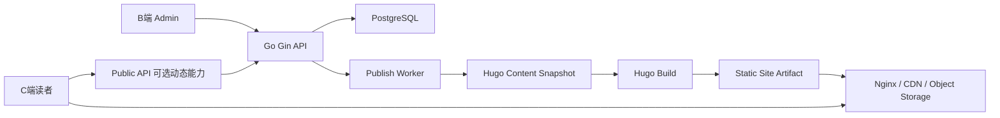

# 全栈博客系统架构总览

## 1. 系统目标

构建一个成熟完整、可长期演进的全栈博客系统：

- C 端读者侧保留 Hugo Theme Stack 的页面设计、阅读体验、SEO 能力和静态站点性能。
- B 端后台提供内容管理、发布控制、媒体管理、评论审核、用户权限、站点设置、数据看板和审计能力。
- 后端采用 Go Gin + GORM，承担业务规则、权限、内容建模、发布任务和 API 服务。
- 数据库采用 PostgreSQL，作为后台编辑态数据、权限数据、发布记录、审计日志和运营数据的主存储。
- 发布结果以 Hugo 可构建内容快照为边界，保证 C 端稳定、可缓存、可回滚。

## 2. 架构一句话

采用“后台动态管理 + Hugo 静态发布”的 Hybrid CMS 架构。

```text
B端 Admin -> Gin API -> PostgreSQL
                     -> Publish Worker -> Hugo Content Snapshot -> Hugo Build -> Static Site
C端 Reader -> Static Site + optional Public API
```

## 3. 系统上下文



核心原则：

- C 端主阅读路径不直接依赖数据库。
- B 端的编辑态、草稿态、审核态、配置态全部进入 PostgreSQL。
- 发布动作生成不可变 Hugo 快照，快照构建为可部署静态站点产物。
- API 不负责拼接 C 端文章页面，而是控制内容生命周期和发布流程。
- 动态能力失败不应影响文章静态阅读。

## 4. C 端 Hugo 角色

C 端定位为最终阅读体验层。

职责：

- 保留 Hugo Theme Stack 的布局、文章页、分类页、标签页、归档页、搜索页、RSS、Sitemap、Open Graph。
- 通过 Hugo 内容目录、front matter、站点配置和主题配置构建静态页面。
- 输出 HTML、CSS、JS、图片和搜索索引。
- 支持 CDN 缓存、静态托管、快速回滚。

非职责：

- 不承担内容编辑。
- 不直接访问 PostgreSQL。
- 不承载后台权限逻辑。
- 不把 Hugo 变成动态 CMS 服务。

可选动态能力：

- 评论、点赞、阅读统计、订阅等通过 Public API 异步增强。
- Public API 挂掉时，文章页面仍应可读。

## 5. B 端 Admin 角色

B 端定位为内容生产与站点运营控制台。

核心模块：

- 数据看板。
- 文章管理。
- 页面管理。
- 分类标签。
- 媒体库。
- 评论审核。
- 发布中心。
- 用户权限。
- 站点设置。
- 审计日志。
- 系统状态。

关键规则：

- Admin 不直接修改 Hugo 发布目录。
- Admin 通过 API 写入 PostgreSQL。
- 发布流水线从 PostgreSQL 生成 Hugo 快照。
- 高危操作必须有权限校验和审计日志。

## 6. API 角色

API 是控制面和业务规则中心。

技术选型：

- Go Gin：HTTP 路由、中间件、认证、参数校验。
- GORM：PostgreSQL 数据访问、事务、模型映射。
- Worker：发布任务、构建任务、异步处理，可先与 API 同进程，后续拆分。

主要 API 边界：

- `/api/v1/admin/*`：后台管理接口。
- `/api/v1/public/*`：C 端动态增强接口。
- `/api/v1/internal/*`：worker、发布、预览、构建回调等内部接口。

核心职责：

- 身份认证与权限控制。
- 内容 CRUD 与版本管理。
- 评论审核。
- 媒体管理。
- 发布任务编排。
- 生成 Hugo 兼容内容模型。
- 维护发布记录、构建状态和回滚指针。
- 暴露审计、日志、健康检查能力。

## 7. PostgreSQL 角色

PostgreSQL 是后台系统事实数据源。

存储范围：

- 用户、角色、权限、会话。
- 文章、页面、分类、标签、作者、菜单。
- 草稿、修订、发布版本。
- 媒体资源、资源引用关系。
- 站点配置、主题配置、SEO 配置。
- 评论、审核状态、反垃圾信息。
- 发布任务、发布快照、构建产物、当前线上版本。
- 访问统计、点赞、日聚合数据。
- 审计日志、操作日志、失败重试记录。

建模原则：

- 内容编辑态与发布态分离。
- 修订历史不可随意覆盖。
- 发布快照不可变。
- 当前线上版本由 active release 指针决定。
- 对发布副作用使用 job/outbox 表，避免 API 请求内同步执行不可控构建。

## 8. 内容源与发布快照机制

采用双层内容模型：

1. 编辑源：PostgreSQL 中的结构化内容。
2. 发布快照：某一时间点生成的 Hugo 兼容文件树。

编辑源包括：

- 正文 Markdown。
- front matter 结构化字段。
- slug、路径、摘要、封面图、发布时间。
- 分类、标签、作者、系列。
- SEO 字段。
- 页面状态。

发布快照包括：

- `content/post/.../index.md`
- `content/page/.../index.md`
- 分类、标签、菜单、站点配置片段。
- 媒体资源清单。
- 快照 manifest：内容 ID、revision ID、hash、生成时间、操作者。

快照规则：

- 快照不可变。
- 同一内容源可生成多个发布快照。
- 回滚不是反向修改文章，而是切换 active release 指针。
- 每次发布都保留构建日志和产物摘要。
- 快照生成必须可重复。

## 9. 发布流水线

推荐状态机：

```text
requested -> snapshotting -> building -> verifying -> promoting -> published
                               |            |             |
                             failed       failed        failed
```

标准流程：

1. Admin 发起发布。
2. API 校验权限、内容状态、slug 唯一性、引用资源完整性。
3. API 创建 `publish_job` 和快照记录。
4. Worker 拉取任务。
5. Worker 从 PostgreSQL 读取发布范围，生成 Hugo 内容快照。
6. Worker 执行 Hugo build。
7. Worker 执行基础校验：首页、文章页、资源、RSS、Sitemap。
8. 构建产物上传到静态托管目录或对象存储。
9. 原子切换当前版本指针。
10. 清理或刷新 CDN 缓存。
11. 写入发布完成记录。

回滚流程：

1. 选择历史 release。
2. 校验产物仍存在。
3. 切换 active release。
4. 刷新缓存。
5. 写入审计日志。

## 10. 推荐 Monorepo 结构

```text
zoking-blog/
  apps/
    site/                  # Hugo + Stack C端站点
    api/                   # Go Gin API
    admin/                 # B端后台
  internal/
    worker/                # 发布 worker 或后台任务
    publisher/             # 快照生成、Hugo 构建、产物发布
  packages/
    contracts/             # OpenAPI、共享类型、接口约定
  db/
    migrations/
    seeds/
  infra/
    docker/
    nginx/
    postgres/
  scripts/
    dev/
    deploy/
  docs/
    architecture/
    requirements/
    backend/
    database/
    frontend/
    operations/
    plan/
    process/
```

说明：

- `apps/site` 保持 Hugo 项目边界，尽量不侵入主题源码。
- `apps/api` 是后台业务入口。
- `apps/admin` 是后台控制台。
- `internal/publisher` 封装发布领域逻辑，避免散落在 handler 中。
- `db/migrations` 由后端统一维护。
- `docs/architecture/adr` 记录关键架构决策。

## 11. 模块边界

API 模块：

- `auth`：认证、会话、权限。
- `users`：后台用户、作者资料。
- `rbac`：角色、权限、绑定关系。
- `content`：文章、页面、修订、状态流转。
- `taxonomy`：分类、标签、系列。
- `media`：上传、存储、引用追踪。
- `siteconfig`：站点配置、主题配置、菜单。
- `comments`：评论提交、审核、反垃圾。
- `publisher`：快照、构建、发布、回滚。
- `stats`：浏览、点赞、评论统计。
- `audit`：操作日志与安全审计。
- `public`：C 端动态增强接口。

边界规则：

- Handler 只负责 HTTP 输入输出。
- Service 负责业务规则。
- Repository/GORM 负责数据访问。
- Publisher 不直接依赖 Admin UI。
- Hugo 生成逻辑只消费发布视图。
- C 端静态站点与 Admin 后台部署解耦。

## 12. 风险与权衡

收益：

- C 端性能好，缓存友好，SEO 稳定。
- Hugo Theme Stack 体验可复用。
- B 端具备完整 CMS 能力。
- 发布产物可追踪、可回滚。
- API 与 C 端阅读主路径解耦。

代价：

- 同时维护数据库内容模型和 Hugo 内容模型。
- 发布链路比纯动态 CMS 更复杂。
- 草稿预览、定时发布、增量构建需要额外设计。
- 媒体资源引用和清理需要严谨处理。
- 快照和构建产物存储需要生命周期管理。

缓解措施：

- 明确 PostgreSQL 为编辑源，Hugo 快照为发布产物。
- 禁止手工修改发布快照作为长期内容源。
- 发布使用状态机、日志、幂等任务和失败重试。
- 每个 release 保留 manifest、hash 和构建日志。
- 先实现全量构建，后续再优化增量构建。
