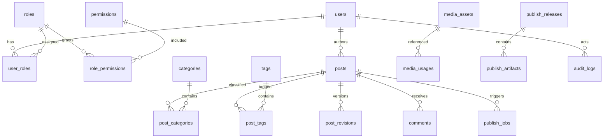

# 数据模型设计

本文描述 PostgreSQL 核心数据模型。实际建表以 `db/migrations` 为准，本文件作为 schema 设计和评审依据。

## 1. ERD 总览



## 2. 通用约定

主键：

- `id uuid primary key default gen_random_uuid()`

时间：

- `created_at timestamptz not null default now()`
- `updated_at timestamptz not null default now()`
- `deleted_at timestamptz null`

操作者：

- `created_by uuid null`
- `updated_by uuid null`
- `deleted_by uuid null`

软删除唯一索引：

```sql
create unique index idx_posts_slug_active on posts(slug) where deleted_at is null;
```

## 3. Auth 与 RBAC 表

### users

| 字段 | 类型 | 说明 |
|---|---|---|
| id | uuid | 主键 |
| email | citext/text | 登录邮箱 |
| username | text | 用户名 |
| password_hash | text | 密码哈希 |
| display_name | text | 展示名 |
| avatar_url | text | 头像 |
| bio | text | 作者介绍 |
| status | text | active/disabled/pending |
| last_login_at | timestamptz | 最近登录 |

索引：

- unique `email where deleted_at is null`
- unique `username where deleted_at is null`
- index `status`

### roles / permissions / user_roles / role_permissions

规则：

- `roles.code` 唯一。
- `permissions.code` 唯一。
- 系统角色 `is_system=true` 不允许删除。
- `user_roles(user_id, role_id)` 唯一。
- `role_permissions(role_id, permission_id)` 唯一。

### refresh_tokens

字段：

- `user_id`
- `token_hash`
- `device_id`
- `user_agent`
- `ip_hash`
- `expires_at`
- `revoked_at`
- `rotated_from_id`

索引：

- unique `token_hash`
- index `(user_id, expires_at)`
- index `revoked_at`

## 4. 内容表

### posts

| 字段 | 类型 | 说明 |
|---|---|---|
| title | text | 标题 |
| slug | text | URL slug |
| summary | text | 摘要 |
| content_md | text | Markdown 正文 |
| content_html | text | 后台预览缓存，可选 |
| cover_media_id | uuid | 封面 |
| status | text | draft/reviewing/rejected/scheduled/published/offline/archived |
| visibility | text | public/private/unlisted |
| is_pinned | boolean | 置顶 |
| is_featured | boolean | 推荐 |
| allow_comment | boolean | 允许评论 |
| published_at | timestamptz | 发布时间 |
| scheduled_at | timestamptz | 定时发布 |
| author_id | uuid | 作者 |
| seo_title | text | SEO 标题 |
| seo_description | text | SEO 描述 |
| seo_keywords | text[] | 关键词 |
| canonical_url | text | canonical |

索引：

- unique `slug where deleted_at is null`
- index `(status, published_at desc)`
- index `(author_id, created_at desc)`
- index `scheduled_at where status='scheduled'`
- index `is_pinned`

### post_revisions

用途：

- 保存草稿历史、发布版本和回滚来源。

字段：

- `post_id`
- `revision_no`
- `title`
- `content_md`
- `meta_json`
- `created_by`
- `created_at`
- `is_published_snapshot`

索引：

- unique `(post_id, revision_no)`
- index `(post_id, created_at desc)`

### pages

用于 About、Links、Projects 等固定页面。

字段类似 posts，但不强制分类标签。

索引：

- unique `slug where deleted_at is null`
- index `(status, sort_order)`

### categories / tags

分类字段：

- `name`
- `slug`
- `description`
- `parent_id`
- `sort_order`
- `enabled`

标签字段：

- `name`
- `slug`
- `description`
- `color`

关系表：

- `post_categories(post_id, category_id)`
- `post_tags(post_id, tag_id)`

## 5. 媒体表

### media_assets

字段：

- `filename`
- `original_name`
- `mime_type`
- `size_bytes`
- `width`
- `height`
- `storage_driver`
- `storage_bucket`
- `storage_key`
- `public_url`
- `checksum`
- `uploaded_by`
- `status`

状态：

- `uploaded`
- `processing`
- `ready`
- `failed`
- `deleted`

索引：

- unique `storage_key`
- index `(uploaded_by, created_at desc)`
- index `mime_type`
- unique `checksum` 可选。

### media_usages

字段：

- `media_id`
- `resource_type`
- `resource_id`
- `usage_type`

用途：

- 删除保护。
- 发布资源清单。
- 清理孤立资源。

## 6. 评论表

### comments

字段：

- `post_id`
- `parent_id`
- `author_name`
- `author_email_hash`
- `author_website`
- `content`
- `status`
- `ip_hash`
- `user_agent`
- `reviewed_by`
- `reviewed_at`
- `spam_reason`

状态：

- `pending`
- `approved`
- `rejected`
- `spam`
- `deleted`

索引：

- index `(post_id, status, created_at desc)`
- index `(status, created_at desc)`
- index `parent_id`

## 7. 站点配置

### site_settings

字段：

- `key`
- `value_json`
- `description`
- `is_public`
- `updated_by`

规则：

- 公开配置可进入 Hugo 配置或 Public API。
- 私密配置不能进入发布快照。

### menus / menu_items

用于生成 Hugo menu 配置和后台导航设置。

字段：

- `menus.code`
- `menus.name`
- `menu_items.title`
- `menu_items.url`
- `menu_items.page_id`
- `menu_items.parent_id`
- `menu_items.sort_order`
- `menu_items.open_in_new_tab`

## 8. 发布表

### publish_jobs

字段：

- `job_type`
- `status`
- `scope`
- `scope_ref_id`
- `requested_by`
- `run_at`
- `locked_at`
- `locked_by`
- `finished_at`
- `retry_count`
- `error_code`
- `error_message`

状态：

- `requested`
- `snapshotting`
- `building`
- `verifying`
- `promoting`
- `published`
- `failed`
- `cancelled`

索引：

- index `(status, run_at)`
- index `(locked_at)`
- index `(requested_by, created_at desc)`

### publish_snapshots

字段：

- `job_id`
- `snapshot_key`
- `manifest_json`
- `content_hash`
- `created_by`

### publish_releases

字段：

- `release_key`
- `snapshot_id`
- `artifact_path`
- `status`
- `is_active`
- `promoted_by`
- `promoted_at`

规则：

- 同一时间只能有一个 active release。
- 回滚通过切换 active release。

### publish_previews

字段：

- `preview_key`、`scope`、`status`
- `post_id` / `page_id` / `requested_by`
- `output_path`、`entry_path`、`url`、`target_url`
- `settings_hash`、`content_hash`
- `manifest_json`、`log_json`
- `error_code`、`error_message`
- `started_at`、`finished_at`、`expires_at`

预览记录只描述隔离构建，不属于 release 历史，也不参与 active release 唯一性约束。默认 TTL 由 `PUBLISH_PREVIEW_TTL` 控制，后续清理任务按 `expires_at` 删除记录和目录。

## 9. 统计与审计

### post_stats / post_daily_stats

用途：

- 浏览量、点赞数、评论数、热门文章。

### audit_logs

字段：

- `actor_id`
- `action`
- `resource_type`
- `resource_id`
- `before_json`
- `after_json`
- `ip_hash`
- `user_agent`
- `result`
- `request_id`

当前增量字段：

- `actor_email`：用户删除后仍可识别操作者。
- `route` / `method` / `status_code` / `error_code`：记录 HTTP 执行结果。
- `details_json`：仅保存安全元数据，当前为 query key 和 Gin error 数量。
- `ip_hash_version`：当前为版本 1，使用 JWT secret 作为 HMAC-SHA256 key。

审计日志禁止保存原始请求体、Authorization、Cookie、密码、token、文章正文和评论正文。当前 P5 采用统一写请求审计；更细的 before/after 字段摘要与业务事务原子审计可在后续增强。

索引：

- index `(actor_id, created_at desc)`
- index `(resource_type, resource_id)`
- index `(action, created_at desc)`
