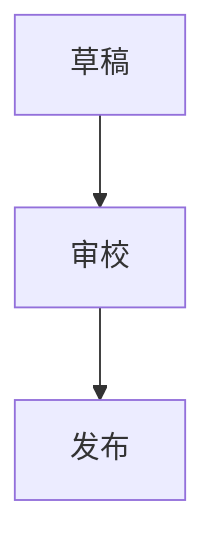

# Zoking Blog 前端工程指导文档

> 本文档用于指导后续使用 Hugo Theme Stack 构建个人博客项目。当前阶段只做工程规划与方法论沉淀，不开始真正改造站点。后续如果由多个子 agent 或多个会话接力工作，应以本文档和工作日志为中心上下文。

## 1. 项目定位

当前目录已经拉取了 `CaiJimmy/hugo-theme-stack` 的主题源码。它本质上是上游主题仓库，不是一个已经成型的个人博客项目。

后续要构建的是“你的博客站点工程”，不是把上游主题随意改成一个不可升级的私人分叉。工程上应该把两层概念分清：

- 主题层：Stack 提供布局、样式、脚本、侧边栏、文章页、短代码、评论、搜索、图片处理、i18n、demo 等通用能力。
- 站点层：你的博客拥有内容、配置、域名、头像、站点标识、菜单、评论服务、部署流程、隐私策略、定制样式和文档。

长期维护的核心原则：

- 优先通过配置使用主题能力。
- 优先在站点层新增内容、资源和覆盖文件。
- 尽量不直接改上游主题内部文件。
- 如果必须改主题内部文件，必须记录原因、影响、验证方式和未来升级策略。

当前上游主题信息：

- 仓库：`https://github.com/CaiJimmy/hugo-theme-stack`
- 当前提交：`v4.0.3`
- Hugo module：`github.com/CaiJimmy/hugo-theme-stack/v4`
- 最低 Hugo 版本：`0.157.0`
- 本地已验证工具链：Hugo Extended `0.160.1`、Dart Sass `1.97.1`、Go `E:\Editor\go`

## 2. 工程目标

这个博客项目应该被当作一个可持续维护的前端工程，而不是一次性页面搭建。

目标包括：

1. 内容生产顺手：写文章、加图片、发布、归档、搜索都应该有稳定流程。
2. 主题可升级：上游 Stack 发布新版时，应该能有控制地升级。
3. 构建可复现：本地、CI、预览和生产环境使用明确工具版本。
4. 配置有边界：哪些是 Hugo 基础配置，哪些是 Stack 主题配置，哪些是部署配置，要分清。
5. 前端体验稳定：桌面端、移动端、深色模式、搜索、图片、代码块、评论都要可验证。
6. 文档可接力：后续如果对话窗口上下文爆了，新窗口能通过日志继续工作。
7. 多 agent 可协作：每个 agent 有清晰职责、文件范围和汇报格式。

暂不做的事情：

- 不从零重写主题。
- 不引入 React/Vue/Svelte 等大型前端框架。
- 不把 Hugo 内容模型复杂化。
- 不为了小样式改动大规模覆盖主题模板。
- 不在没有部署目标前过度设计 CI/CD。

## 3. 推荐仓库策略

有两种工程路径。

### 3.1 推荐路径：独立站点仓库 + Hugo Module 引入主题

这是最适合长期维护的方案。

站点仓库负责：

- `content/`：你的文章与页面。
- `config/_default/`：你的站点配置。
- `assets/`：你的头像、favicon、自定义 SCSS、自定义 TS。
- `static/`：不需要 Hugo 处理的静态资源。
- `docs/`：工程文档、工作日志、部署手册。
- `go.mod`：声明依赖 Stack 主题模块。

推荐目录：

```text
zoking-blog/
  archetypes/
    default.md
    post.md
  assets/
    img/
      avatar.png
      favicon.png
    scss/
      custom.scss
    ts/
      custom.ts
    icons/
  config/
    _default/
      hugo.toml
      params.toml
      menu.toml
      markup.toml
      related.toml
      languages.toml
  content/
    _index.md
    post/
      hello-stack/
        index.md
        cover.jpg
    page/
      about/
        index.md
      archives/
        index.md
      search/
        index.md
  docs/
    frontend-engineering-guide.md
    worklog.md
    content-style-guide.md
    deployment-runbook.md
    theme-upgrade-notes.md
  static/
  go.mod
  README.md
```

推荐 `go.mod`：

```go
module github.com/zo-king/zoking_blog

go 1.25

require github.com/CaiJimmy/hugo-theme-stack/v4 v4.0.3
```

推荐 `config/_default/hugo.toml`：

```toml
baseURL = "https://your-domain.example/"
title = "Zoking"
defaultContentLanguage = "zh-cn"
hasCJKLanguage = true

[[module.imports]]
    path = "github.com/CaiJimmy/hugo-theme-stack/v4"

[pagination]
    pagerSize = 6

[permalinks]
    post = "/p/:slug/"
    page = "/:slug/"
```

优点：

- 主题可升级。
- 内容和主题边界清楚。
- 站点配置不会污染上游主题。
- 后续迁移、部署、协作更清楚。

代价：

- 初始搭建比直接改当前主题目录多一步。
- 需要理解 Hugo Module。

### 3.2 快速路径：在当前主题目录上叠加博客内容

这个路径适合短期实验，不推荐作为长期方案。

如果选择这个路径，必须遵守：

- 不随意改 `layouts/`、`assets/scss/`、`assets/ts/` 里的主题核心文件。
- 新增站点内容、配置和文档时要明确标记为本项目定制。
- 创建 `docs/worklog.md` 记录每次修改。
- 创建 `docs/theme-upgrade-notes.md` 记录本地覆盖和未来升级风险。

风险：

- 后续拉取上游更新可能发生冲突。
- 容易分不清哪些文件是主题原生，哪些是站点定制。
- 新 agent 接手时容易误改上游主题。

## 4. 工具链与环境

必须工具：

- Hugo Extended：最低 `0.157.0`，建议使用 `0.160.1` 或后续稳定版本。
- Dart Sass：Stack 使用 SCSS，Hugo Extended 会调用 Sass 处理。
- Go：Hugo Modules 依赖 Go 模块解析。
- Git：版本管理。

可选工具：

- Node.js：部分部署平台或辅助脚本可能需要。
- 图片压缩工具：用于压缩封面图和正文图片。
- 浏览器自动化工具：用于后续截图、移动端检查和交互验证。

本机 Go 环境记录：

- Go 安装目录：`E:\Editor\go`
- 用户级 `GOROOT` 已设置为：`E:\Editor\go`
- 用户级 `Path` 已包含：`E:\Editor\go\bin`
- 系统级 `GOROOT` 仍可能残留旧值：`S:\Compiler\Go`

如果要彻底修复系统级环境变量，需要管理员 PowerShell：

```powershell
setx /M GOROOT "E:\Editor\go"
```

基础检查命令：

```powershell
go version
go env GOROOT
hugo version
sass --version
git status --short --branch
```

开发命令：

```powershell
hugo server -D --gc --disableFastRender
```

生产构建命令：

```powershell
hugo --gc --minify
```

为什么使用 `--disableFastRender`：

- 修改配置、模板、主题覆盖文件时，Hugo 快速渲染有时不会完整刷新。
- 开发阶段宁愿慢一点，也要避免看到过期页面。

## 5. Stack 主题架构理解

Stack 是 Hugo 主题，不是传统 Node 前端项目。当前根目录没有 `package.json`，不要假设有 npm build。

主题核心目录：

```text
layouts/
  baseof.html
  home.html
  list.html
  single.html
  archives.html
  404.html
  page/
  _partials/
  _markup/
  _shortcodes/
assets/
  scss/
  ts/
  icons/
config/
  _default/
i18n/
data/
demo/
```

核心模板：

- `layouts/baseof.html`：全站 HTML 壳、左右侧边栏、主容器、footer include。
- `layouts/home.html`：首页文章列表和首页右侧 widgets。
- `layouts/single.html`：文章页、相关文章、评论、图片灯箱、Mermaid。
- `layouts/list.html`：分类、标签、section 列表页。
- `layouts/archives.html`：归档页。
- `layouts/page/search.html`：搜索页面 UI。
- `layouts/page/search.json`：搜索索引 JSON。
- `layouts/404.html`：404 页面和搜索建议。

核心前端资源：

- `assets/scss/style.scss`：SCSS 总入口。
- `assets/scss/custom.scss`：站点自定义 SCSS 入口，应该优先使用。
- `assets/ts/main.ts`：主题主脚本入口。
- `assets/ts/search.tsx`：搜索逻辑。
- `assets/ts/gallery.ts`：图片 gallery 和 PhotoSwipe 处理。
- `assets/ts/colorScheme.ts`：深色/浅色/自动主题逻辑。
- `assets/ts/mermaid.ts`：Mermaid 渲染和全屏查看。
- `assets/ts/cookies.ts`：Cookie consent。
- `assets/ts/commentsConsent.ts`：评论 consent gate。

核心 partial：

- `layouts/_partials/sidebar/left.html`：左侧栏。
- `layouts/_partials/sidebar/right.html`：右侧 widgets。
- `layouts/_partials/widget/`：搜索、归档、分类、标签云、TOC。
- `layouts/_partials/article/`：文章组件。
- `layouts/_partials/comments/`：评论系统。
- `layouts/_partials/head/`：meta、样式、Open Graph、favicon。
- `layouts/_partials/helper/`：图片、图标、分页、排序等工具。

主题内置能力：

- 卡片式博客首页。
- 响应式布局。
- 左侧栏导航。
- 右侧栏 widgets。
- 明暗色切换。
- 搜索。
- 归档页。
- 标签和分类。
- 文章目录。
- 代码复制。
- 图片灯箱。
- Mermaid 图表。
- KaTeX 数学公式。
- 多评论系统。
- Cookie consent。
- i18n。
- 图片处理和响应式图片。

## 6. 配置文件设计

站点配置应拆分到 `config/_default/`。

推荐文件职责：

```text
config/_default/
  hugo.toml       # Hugo 基础配置：baseURL、语言、模块、分页、permalink
  params.toml     # Stack 主题参数：侧边栏、文章、widgets、评论、cookie、图片
  menu.toml       # 主菜单和社交菜单
  markup.toml     # Markdown、代码高亮、TOC、数学公式 passthrough
  related.toml    # 相关文章规则
  languages.toml  # 多语言配置，如暂时单语言可不建
```

### 6.1 `hugo.toml`

需要决策：

- `baseURL`：必须是最终生产域名。
- `title`：站点名称。
- `defaultContentLanguage`：中文站建议 `zh-cn`。
- `hasCJKLanguage`：中文站必须设为 `true`，否则摘要和字数统计可能不理想。
- `pagination.pagerSize`：首页每页文章数，建议 6 或 8。
- `permalinks`：文章永久链接规则。
- `module.imports`：主题模块依赖。

推荐：

```toml
baseURL = "https://your-domain.example/"
title = "Zoking"
defaultContentLanguage = "zh-cn"
hasCJKLanguage = true

[[module.imports]]
    path = "github.com/CaiJimmy/hugo-theme-stack/v4"

[pagination]
    pagerSize = 6

[permalinks]
    post = "/p/:slug/"
    page = "/:slug/"
```

永久链接原则：

- 不建议默认用中文标题生成 URL。
- 每篇文章必须写 `slug`。
- URL 一旦发布，除非必要不要改。
- 不建议把日期放进 URL，除非你的博客强依赖时间归档。

### 6.2 `params.toml`

这是 Stack 最重要的配置文件。

推荐初始配置：

```toml
mainSections = ["post"]
rssFullContent = true
SortBy = "default"
favicon = "img/favicon.png"

[footer]
    since = 2026
    customText = ""

[dateFormat]
    published = ":date_full"
    lastUpdated = ":date_full"

[sidebar]
    compact = false
    emoji = ""
    subtitle = "记录工程、系统、产品与日常思考"
    avatar = "img/avatar.png"

[article]
    headingAnchor = true
    math = false
    toc = true
    readingTime = true

    [article.list]
        showTags = true

    [article.license]
        enabled = true
        default = "Licensed under CC BY-NC-SA 4.0"

[widgets]
    homepage = [
        { type = "search" },
        { type = "archives", params = { limit = 5 } },
        { type = "categories", params = { limit = 10 } },
        { type = "tag-cloud", params = { limit = 20 } },
    ]
    page = [
        { type = "toc" },
    ]

[colorScheme]
    toggle = true
    default = "auto"

[imageProcessing]
    autoOrient = true

    [imageProcessing.external]
        timeout = "5s"

    [imageProcessing.content]
        widths = [800, 1600, 2400]
        enabled = true

    [imageProcessing.thumbnail]
        enabled = true
```

配置原则：

- `mainSections` 保持 `["post"]`，除非后续有多个主要内容 section。
- `rssFullContent = true` 适合内容型博客。
- `headingAnchor = true` 适合技术文章引用小节。
- `math` 默认关闭，只在单篇文章 frontmatter 里开启。
- `widgets.homepage` 不要堆太多，右侧栏越克制越好。
- `widgets.page` 先只保留 TOC。

### 6.3 `menu.toml`

主菜单只放读者最常用入口。

推荐：

```toml
[[main]]
    identifier = "home"
    name = "首页"
    url = "/"
    weight = 10
    [main.params]
        icon = "home"

[[main]]
    identifier = "archives"
    name = "归档"
    url = "/archives/"
    weight = 20
    [main.params]
        icon = "archives"

[[main]]
    identifier = "search"
    name = "搜索"
    url = "/search/"
    weight = 30
    [main.params]
        icon = "search"

[[main]]
    identifier = "about"
    name = "关于"
    url = "/about/"
    weight = 40
    [main.params]
        icon = "user"
```

社交菜单：

```toml
[[social]]
    identifier = "github"
    name = "GitHub"
    url = "https://github.com/your-name"

    [social.params]
        icon = "brand-github"
```

图标策略：

- 优先使用主题已有 `assets/icons/` 图标。
- 如果新增图标，放在站点层 `assets/icons/`。
- 不为了一个社交链接去改主题模板。

### 6.4 `markup.toml`

推荐：

```toml
[goldmark]
    [goldmark.renderer]
        unsafe = true

    [goldmark.extensions]
        [goldmark.extensions.passthrough]
            enable = true

            [goldmark.extensions.passthrough.delimiters]
                block = [["\\[", "\\]"], ["$$", "$$"]]
                inline = [["\\(", "\\)"]]

[tableOfContents]
    startLevel = 2
    endLevel = 4
    ordered = true

[highlight]
    noClasses = false
    codeFences = true
    guessSyntax = true
    lineNoStart = 1
    lineNos = true
    lineNumbersInTable = true
    tabWidth = 4
```

注意：

- `unsafe = true` 可以让文章里写 HTML，但也意味着作者必须只使用可信内容。
- 如果你经常复制第三方 HTML，需要建立审核习惯。

### 6.5 `related.toml`

推荐：

```toml
includeNewer = true
threshold = 60
toLower = false

indices = [
    { name = "tags", weight = 100 },
    { name = "categories", weight = 200 },
]
```

策略：

- `categories` 权重大，表示大主题。
- `tags` 权重稍小，表示细粒度标签。
- 如果后续有系列文章，可以增加 `series`。

## 7. 内容架构

推荐使用 Hugo page bundle。

目录：

```text
content/
  _index.md
  post/
    my-post-slug/
      index.md
      cover.jpg
      image-1.png
  page/
    about/
      index.md
    archives/
      index.md
    search/
      index.md
  categories/
    engineering/
      _index.md
  tags/
    hugo/
      _index.md
```

为什么用 page bundle：

- 文章和图片放在一起，迁移方便。
- Hugo 可以处理文章本地图片资源。
- 删除文章时不容易留下孤儿图片。
- 图片路径短，Markdown 更易读。

内容 section 建议：

- `post/`：主文章。
- `page/`：独立页面，如关于、搜索、归档、友链。
- `categories/`：分类解释页，可选。
- `tags/`：标签解释页，可选。

暂时不建议一开始就建立太多 section。除非内容类型明显不同，例如：

- `notes/`：短笔记。
- `projects/`：项目展示。
- `reading/`：读书记录。

如果没有稳定需求，先全部放 `post/`。

## 8. 必备页面

Stack 的搜索和 widgets 依赖一些页面存在。

### 8.1 归档页

路径：`content/page/archives/index.md`

```markdown
---
title: 归档
slug: archives
layout: archives
menu:
  main:
    weight: 20
    params:
      icon: archives
comments: false
---
```

### 8.2 搜索页

路径：`content/page/search/index.md`

```markdown
---
title: 搜索
slug: search
layout: search
outputs:
  - html
  - json
menu:
  main:
    weight: 30
    params:
      icon: search
comments: false
---
```

搜索页必须输出 JSON，否则搜索脚本没有数据源。

### 8.3 关于页

路径：`content/page/about/index.md`

```markdown
---
title: 关于
slug: about
menu:
  main:
    weight: 40
    params:
      icon: user
comments: false
---

这里写站点和作者介绍。
```

### 8.4 首页

路径：`content/_index.md`

```markdown
---
title: 首页
---
```

Stack 首页主要由 `home.html` 渲染文章列表，首页正文可以保持简洁。

## 9. Frontmatter 规范

每篇文章建议使用统一字段。

推荐模板：

```yaml
---
title: "文章标题"
description: "一句话摘要，用于列表、SEO 和社交分享。"
date: 2026-06-18T10:00:00+08:00
lastmod: 2026-06-18T10:00:00+08:00
slug: "stable-post-slug"
image: "cover.jpg"
categories:
  - Engineering
tags:
  - Hugo
  - Frontend
draft: true
toc: true
readingTime: true
comments: true
math: false
---
```

字段要求：

- `title`：必填。
- `description`：公开文章必填。
- `date`：必填，带时区。
- `lastmod`：内容有实质更新时再改。
- `slug`：必填，不依赖中文标题生成 URL。
- `image`：重要文章建议配置。
- `categories`：1 到 2 个大分类。
- `tags`：3 到 8 个标签。
- `draft`：发布前为 `true`。
- `toc`：默认继承站点配置，特殊文章再覆盖。
- `comments`：页面类内容通常关闭。
- `math`：只在需要公式时开启。

分类和标签原则：

- 分类是书架，数量少且稳定。
- 标签是索引，数量可以多但要受控。
- 不要同时出现 `前端`、`Frontend`、`front-end` 这类重复标签，除非有明确多语言策略。

## 10. 写作流程

推荐流程：

1. 在 `content/post/<slug>/` 创建文章目录。
2. 创建 `index.md`。
3. 添加 `cover.jpg` 和正文图片。
4. frontmatter 设置 `draft: true`。
5. 本地运行 `hugo server -D --gc --disableFastRender`。
6. 检查文章页、首页列表、标签页、分类页、搜索页。
7. 发布前改为 `draft: false`。
8. 运行 `hugo --gc --minify`。
9. 提交文章和图片。

写作习惯：

- 先写结构，再补细节。
- 图片跟随文章放入 page bundle。
- 不要把大图直接原样提交，先压缩。
- 发布前检查 `slug`，发布后尽量不改。
- 文章标题可以中文，URL slug 建议英文或拼音。

## 11. Markdown 规范

标题：

```markdown
## 一级章节
### 二级小节
```

不要在正文里使用 `#`，页面标题已经由主题处理。

图片：

```markdown

```

代码块：

````markdown
```ts
const name = "zoking";
```
````

表格可以正常写，主题会对表格做响应式包裹。

Mermaid：

````markdown

````

数学公式：

```markdown
行内公式：\( a^2 + b^2 = c^2 \)

块级公式：
$$
E = mc^2
$$
```

公式文章需要：

```yaml
math: true
```

## 12. 资源与视觉系统

站点层资源建议：

```text
assets/
  img/
    avatar.png
    favicon.png
  scss/
    custom.scss
  ts/
    custom.ts
  icons/
    custom-icon.svg
```

定制优先级：

1. 修改配置。
2. 修改内容和 frontmatter。
3. 写 `assets/scss/custom.scss`。
4. 写 `assets/ts/custom.ts`。
5. 覆盖小 partial。
6. 最后才改主题源码。

不建议直接修改：

- `assets/scss/style.scss`
- `assets/scss/variables.scss`
- `assets/ts/main.ts`
- `layouts/baseof.html`
- `layouts/single.html`
- `layouts/home.html`

视觉原则：

- 保留 Stack 的卡片式博客性格。
- 不要做成复杂营销页。
- 控制主色，不要把界面做成单一色块。
- 明暗模式都要检查。
- 移动端优先保证阅读体验。
- 自定义样式要少而准。

## 13. 图片工程

Stack 图片能力：

- 支持 page bundle 本地图片。
- 支持远程图片拉取。
- 支持自动旋转。
- 支持正文图片响应式宽度。
- 支持缩略图处理。

推荐配置：

```toml
[imageProcessing]
    autoOrient = true

    [imageProcessing.external]
        timeout = "5s"

    [imageProcessing.content]
        widths = [800, 1600, 2400]
        enabled = true

    [imageProcessing.thumbnail]
        enabled = true
```

图片规范：

- 封面图统一命名 `cover.jpg` 或 `cover.png`。
- 原创图片放入文章 bundle。
- 远程图片只用于版权和稳定性都明确的场景。
- 重要图片必须有 alt。
- 大图提交前压缩。
- 截图类图片尽量裁掉无关区域。

## 14. 搜索系统

Stack 搜索由三部分组成：

- `layouts/page/search.html`
- `layouts/page/search.json`
- `assets/ts/search.tsx`

必须条件：

- 存在搜索页面。
- 搜索页面有 `outputs = ["html", "json"]`。
- 文章有清晰标题和正文。

搜索索引包含：

- 标题。
- 日期。
- 链接。
- 正文纯文本。
- 可选图片。

风险：

- 文章数量很大时，搜索 JSON 会变大。
- 如果文章塞入大量无关文本，搜索质量会下降。
- 如果页面没有 JSON 输出，搜索 UI 会存在但不可用。

## 15. 评论系统

Stack 支持多种评论服务：

- Disqus
- Giscus
- Gitalk
- Utterances
- Waline
- Twikoo
- Remark42
- Cusdis
- Comentario
- Artalk
- Cactus
- Vssue

推荐选择：

- 技术博客优先考虑 Giscus。
- 如果不想依赖评论系统，初期可以关闭评论。
- 不建议一开始就接入重型第三方评论，除非你明确需要。

Giscus 配置形态：

```toml
[comments]
    enabled = true
    provider = "giscus"

    [comments.giscus]
        repo = "owner/repo"
        repoID = ""
        category = "General"
        categoryID = ""
        mapping = "pathname"
        lightTheme = "light"
        darkTheme = "dark_dimmed"
        reactionsEnabled = 1
        emitMetadata = 0
        inputPosition = "top"
        lang = "zh-CN"
        strict = 0
        loading = "lazy"
```

评论策略：

- 普通文章可以开启评论。
- 关于页、归档页、搜索页关闭评论。
- 如果启用 cookie consent，评论可能属于 functional cookies。
- 评论服务上线前要检查移动端和暗色主题。

## 16. Cookie Consent 与隐私

Stack 支持 Cookie consent。

推荐隐私优先配置：

```toml
[cookies]
    enabled = true
    showSettings = true

    [cookies.categories]
        analytics = true
        functional = true
```

何时开启：

- 使用 Google Analytics 等统计服务。
- 使用会写 cookie 的评论服务。
- 使用第三方嵌入脚本。

何时可以关闭：

- 没有统计。
- 没有评论。
- 没有第三方追踪脚本。

要求：

- 分析脚本不能在同意前加载。
- 评论如果依赖功能性 cookie，需要等 functional consent。
- Cookie banner 要在无痕窗口测试。

## 17. 明暗色主题

推荐：

```toml
[colorScheme]
    toggle = true
    default = "auto"
```

检查项：

- 系统浅色模式首次访问。
- 系统深色模式首次访问。
- 手动切换。
- 刷新后偏好保留。
- 代码块颜色。
- 表格颜色。
- 引用块颜色。
- Mermaid 图。
- 评论区。
- 搜索结果。

## 18. Mermaid 图表

Stack 只在页面包含 Mermaid 代码块时加载 Mermaid，这是好的性能策略。

推荐：

```toml
[article.mermaid]
    look = "classic"
    lightTheme = "default"
    darkTheme = "dark"
    securityLevel = "strict"
    htmlLabels = true
    transparentBackground = false
```

使用场景：

- 系统架构图。
- 工作流。
- 状态机。
- 依赖关系。
- 发布流程。

注意：

- 图不要太宽。
- 移动端要可读。
- 大图要检查全屏模式。
- 不要滥用 Mermaid 替代文字说明。

## 19. 数学公式

Stack 通过 KaTeX 支持数学公式。

策略：

- 全局 `article.math = false`。
- 单篇文章需要时设置 `math: true`。
- `markup.toml` 中启用 passthrough。
- 检查公式在 RSS 和摘要里的表现。

## 20. 多语言

如果先做中文博客，建议先单语言：

```toml
defaultContentLanguage = "zh-cn"
hasCJKLanguage = true
```

如果计划中英文双语，要提前设计：

- URL 结构。
- 翻译文件命名。
- 语言切换规则。
- 标签和分类是否翻译。
- 首页、关于页、搜索页是否都有翻译。

示例：

```toml
[zh-cn]
    label = "简体中文"
    title = "Zoking"
    weight = 1

    [zh-cn.params.sidebar]
        subtitle = "记录工程、系统、产品与日常思考"

[en]
    label = "English"
    title = "Zoking"
    weight = 2

    [en.params.sidebar]
        subtitle = "Notes on engineering, systems, products, and life"
```

如果没有明确双语发布计划，不要先把项目复杂化。

## 21. SEO 与元信息

Stack 已经处理：

- `<title>`
- description meta
- canonical URL
- Open Graph
- Twitter card
- RSS alternate output
- favicon

作者责任：

- 每篇公开文章写 `description`。
- 重要文章配置 `image`。
- `baseURL` 必须准确。
- 不要制造重复 slug。
- 转载文章才考虑 `canonicalUrl`。

检查项：

- 页面源码 title 正确。
- description 正确。
- canonical URL 正确。
- Open Graph 图片可访问。
- RSS feed 可访问。
- 404 页面可用。

## 22. 可访问性

最低要求：

- 图片有有效 alt。
- 链接文字有意义。
- 标题层级正确。
- 键盘可以操作菜单、搜索、评论、Cookie 设置。
- 浅色和深色都有足够对比度。
- 图标按钮有 title 或可理解文本。

重点检查：

- 左侧栏社交图标。
- 移动端菜单。
- 搜索输入框。
- Cookie 设置弹层。
- Mermaid 全屏弹层。
- 评论输入区。

## 23. 性能预算

Stack 的性能优势：

- 静态 HTML。
- Hugo 图片处理。
- 条件加载 Mermaid。
- 图片 lazy loading。
- 资源 fingerprint。
- 无大型前端框架。

主要风险：

- 第三方评论脚本。
- 第三方统计脚本。
- 远程图片。
- 未压缩大图。
- 搜索 JSON 过大。
- 文章内嵌太多外部 iframe。

建议预算：

- 首页保持轻量。
- 封面图压缩后再提交。
- 评论系统延迟加载或谨慎选择。
- Mermaid 只在需要的文章中使用。
- 定期检查搜索 JSON 大小。

## 24. 安全与隐私

安全原则：

- 不粘贴不可信 HTML。
- `unsafe = true` 只代表作者可信，不代表外部内容可信。
- 不提交密钥。
- 不把 analytics token、评论服务 secret 放仓库。
- 避免未知第三方脚本。
- 定期升级 Hugo 和主题。

隐私原则：

- 能不用追踪就不用。
- 用统计服务就写清楚。
- 评论服务是否跨站追踪要评估。
- Cookie consent 不要只是装饰，要真正控制脚本加载。

## 25. 部署方案

可选平台：

- Cloudflare Pages / Workers Assets
- GitHub Pages
- Netlify
- Vercel
- 自托管静态服务器

Stack 上游仓库有 `wrangler.toml` 和 `.ci/build.sh`，说明 Cloudflare 路线是自然选择之一。

部署环境必须支持：

- Hugo Extended
- Go
- Dart Sass
- Hugo Modules

生产构建：

```powershell
hugo --gc --minify
```

预览构建：

```powershell
hugo --gc --minify --buildDrafts --buildFuture
```

部署前检查：

- 构建通过。
- 首页正常。
- 文章页正常。
- 搜索页正常。
- 归档页正常。
- RSS 正常。
- 404 正常。
- 暗色模式正常。
- 移动端正常。

## 26. 分支与发布流程

推荐分支：

- `main`：生产可发布状态。
- `feature/*`：工程功能。
- `draft/*`：长文章草稿。
- `theme-upgrade/*`：主题升级。
- `deploy/*`：部署配置调整。

发布流程：

1. 新建分支。
2. 完成变更。
3. 本地构建。
4. 浏览器检查。
5. 更新工作日志。
6. 提交。
7. 合并。
8. 部署。
9. 验证线上。

发布检查清单：

- `hugo --gc --minify` 通过。
- 没有误提交生成物。
- `git status --short` 干净。
- 关键页面可访问。
- 搜索可用。
- RSS 可用。
- 移动端可读。
- 暗色模式可读。

## 27. 上游主题升级策略

升级前：

- 查看上游 release 或 commit log。
- 查看 `theme.toml` 最低 Hugo 版本。
- 查看 `go.mod` module path 是否变化。
- 当前版本先构建一次并记录。

升级步骤：

```powershell
hugo mod get -u github.com/CaiJimmy/hugo-theme-stack/v4
hugo mod tidy
hugo --gc --minify
```

升级后：

- 检查首页。
- 检查文章页。
- 检查搜索。
- 检查评论。
- 检查 widgets。
- 检查自定义 partial 是否还兼容。
- 更新 `docs/theme-upgrade-notes.md`。

如果有本地覆盖：

- 对照上游同路径文件。
- 判断是否需要同步新变化。
- 不要静默吞掉上游 bugfix。

## 28. 覆盖策略

Hugo 允许站点层用同路径文件覆盖主题文件。

低风险覆盖：

```text
layouts/_partials/head/custom.html
layouts/_partials/footer/custom.html
assets/scss/custom.scss
assets/ts/custom.ts
assets/icons/custom.svg
```

中风险覆盖：

```text
layouts/_partials/article/components/*.html
layouts/_partials/sidebar/*.html
layouts/_partials/widget/*.html
```

高风险覆盖：

```text
layouts/baseof.html
layouts/single.html
layouts/home.html
layouts/_partials/helper/image.html
layouts/_partials/helper/paginator.html
```

规则：

- 低风险覆盖可以常规使用。
- 中风险覆盖要记录原因。
- 高风险覆盖必须经过明确设计评审。
- 所有覆盖都要写入工作日志。

## 29. 工程文档体系

推荐最终保留：

```text
docs/
  frontend-engineering-guide.md
  worklog.md
  content-style-guide.md
  deployment-runbook.md
  theme-upgrade-notes.md
```

### 29.1 `docs/worklog.md`

工作日志用于跨窗口、跨 agent 接力。

模板：

```markdown
# Worklog

## 2026-06-18

### 本轮目标

说明本轮要做什么。

### 当前上下文

- 分支：
- 主题版本：
- 工具版本：
- 相关文档：

### 决策记录

- 决策：
- 原因：
- 替代方案：
- 影响：

### 文件变更

- 文件：
- 说明：

### 验证记录

- 命令：
- 结果：

### 风险与问题

- 问题：
- 影响：
- 处理建议：

### 下一步

- 任务：
- 负责人：
```

### 29.2 `content-style-guide.md`

应该记录：

- 文章结构。
- 标题风格。
- 分类和标签规则。
- 图片规范。
- 代码块规范。
- Mermaid 使用规范。
- 发布前检查清单。

### 29.3 `deployment-runbook.md`

应该记录：

- 部署平台。
- 环境变量。
- 构建命令。
- 回滚方式。
- 域名配置。
- 常见失败处理。

### 29.4 `theme-upgrade-notes.md`

应该记录：

- 当前主题版本。
- 升级历史。
- 本地覆盖文件。
- 升级冲突。
- 兼容性风险。

## 30. 多 agent 协作模型

如果后续使用多个子 agent，当前对话窗口应该充当中心调度。

中心调度职责：

- 维护总计划。
- 分配任务。
- 控制文件写入边界。
- 防止重复劳动。
- 防止互相覆盖。
- 统一检查结果。
- 更新工作日志。
- 决定是否开新窗口继续。

推荐角色：

- 配置 agent：负责 `config/_default/*`。
- 内容架构 agent：负责 `content/`、archetypes、taxonomy。
- 前端定制 agent：负责 `assets/scss/custom.scss`、`assets/ts/custom.ts`。
- 部署 agent：负责 CI、部署配置和 runbook。
- QA agent：负责构建、浏览器检查、移动端、暗色模式、搜索、可访问性。
- 文档 agent：负责工作日志、工程文档、升级记录。

任务分配格式：

```markdown
任务：

目标：

允许编辑：

禁止编辑：

输入资料：

预期产物：

验证方式：

汇报要求：
```

硬规则：

- 每个 agent 必须有不重叠的写入范围。
- 每个 agent 必须汇报改了哪些文件。
- 每个 agent 必须汇报验证命令和结果。
- agent 不得还原其他人改动。
- agent 不得擅自改主题核心文件。
- 所有决策写入 `docs/worklog.md`。

上下文爆掉时：

1. 停止继续口头推进。
2. 确认 `docs/worklog.md` 已更新。
3. 新窗口先读：
   - `docs/frontend-engineering-guide.md`
   - `docs/worklog.md`
   - `git status --short --branch`
4. 新窗口根据日志继续，不从零开始。

## 31. 实施阶段规划

### Phase 0：工程基线

目标：建立工程规则。

任务：

- 确定仓库策略。
- 固定工具链。
- 创建工程文档。
- 创建工作日志。
- 验证主题构建。

验收：

- 文档存在。
- 工作日志存在。
- 构建命令明确。
- 当前主题版本明确。

### Phase 1：站点骨架

目标：跑起来一个最小博客。

任务：

- 创建 Hugo 站点结构。
- 写 `config/_default/*`。
- 添加首页、关于、归档、搜索。
- 添加头像和 favicon。
- 添加一篇测试文章。

验收：

- `hugo server -D` 可运行。
- `hugo --gc --minify` 通过。
- 搜索 JSON 存在。

### Phase 2：内容系统

目标：让写作可重复。

任务：

- 创建文章 archetype。
- 定义 frontmatter。
- 定义分类和标签。
- 写内容风格指南。
- 添加 page bundle 示例。

验收：

- 新文章可以按模板创建。
- 图片能正常处理。
- 分类和标签能渲染。

### Phase 3：视觉定制

目标：让站点有个人识别度。

任务：

- 配置侧边栏。
- 添加自定义 SCSS。
- 调整文章排版细节。
- 检查明暗色模式。
- 检查移动端。

验收：

- 首页、文章页、列表页视觉稳定。
- 移动端无明显错位。
- 暗色模式无明显对比问题。

### Phase 4：集成服务

目标：接入可选第三方能力。

任务：

- 选择评论系统。
- 选择是否使用 analytics。
- 配置 cookie consent。
- 配置 Open Graph 默认图。

验收：

- 第三方脚本来源明确。
- 隐私策略明确。
- 评论可用或明确关闭。

### Phase 5：部署上线

目标：稳定发布。

任务：

- 选择平台。
- 配置构建命令。
- 配置域名。
- 写部署 runbook。
- 验证生产环境。

验收：

- 生产 URL 可访问。
- 构建日志干净。
- 回滚方式明确。

### Phase 6：维护运营

目标：长期健康。

任务：

- 定期升级主题。
- 检查坏链。
- 检查搜索索引大小。
- 检查图片体积。
- 更新内容规范。

验收：

- 有维护节奏。
- 有升级记录。
- 有问题处理记录。

## 32. 质量门禁

每次工程变更至少运行：

```powershell
hugo --gc --minify
git status --short
```

每次前端定制额外检查：

- 首页桌面端。
- 首页移动端。
- 文章页。
- 列表页。
- 搜索。
- 归档。
- 暗色模式。
- 图片灯箱。
- 代码块。

每次内容发布检查：

- `draft` 是否关闭。
- `slug` 是否稳定。
- `description` 是否存在。
- 图片 alt 是否有效。
- 分类标签是否合适。
- RSS 是否可接受。

## 33. 当前已知注意点

1. 当前目录是上游主题源码，不是最终博客站点。
2. Stack v4 的 module path 是 `github.com/CaiJimmy/hugo-theme-stack/v4`。
3. 当前 demo 里仍出现 v3 import，但通过本地 replace 仍可构建；正式站点应使用 v4。
4. 根目录没有 `package.json`，构建不走 npm。
5. SCSS 和 TS 由 Hugo Pipes 编译。
6. 搜索页必须输出 JSON。
7. 归档 widget 需要归档页面存在。
8. Mermaid 是按页面条件加载。
9. Math 不要全局默认打开。
10. Cookie consent 只有真正控制脚本加载才有意义。

## 34. 初始推荐决策

建议后续采用：

- 使用独立站点工程，通过 Hugo Module 引入 Stack。
- 默认语言中文，启用 `hasCJKLanguage = true`。
- 所有文章使用 page bundle。
- 所有文章显式写 `slug`。
- 初期评论可以先关闭；需要时优先考虑 Giscus。
- 没有 analytics 前先不启用 cookie consent。
- 自定义样式集中写在 `assets/scss/custom.scss`。
- 自定义脚本集中写在 `assets/ts/custom.ts`。
- 建立 `docs/worklog.md` 作为跨窗口协作核心。

## 35. 开工前检查清单

真正开始搭站前，先确认：

- 仓库策略已确定。
- 域名或临时 baseURL 已确定。
- 站点名称已确定。
- 头像和 favicon 已准备。
- 是否开启评论已确定。
- 是否接入 analytics 已确定。
- 是否多语言已确定。
- 部署平台大方向已确定。
- `docs/worklog.md` 已创建。

## 36. 第一轮实施顺序

建议第一轮不要贪多，只做能跑通闭环的骨架。

顺序：

1. 建立或确认站点工程。
2. 写 `docs/worklog.md`。
3. 写 Hugo 配置。
4. 添加必备页面。
5. 添加头像和 favicon。
6. 添加一篇测试文章。
7. 本地启动。
8. 生产构建。
9. 检查核心页面。
10. 更新工作日志。

## 37. 参考资料

- Stack 中文 Guide：https://stack.cai.im/zh/guide/
- Stack 仓库：https://github.com/CaiJimmy/hugo-theme-stack
- Stack Starter：https://github.com/CaiJimmy/hugo-theme-stack-starter
- Hugo Modules：https://gohugo.io/hugo-modules/
- Hugo 配置：https://gohugo.io/getting-started/configuration/
- Hugo 内容管理：https://gohugo.io/content-management/
