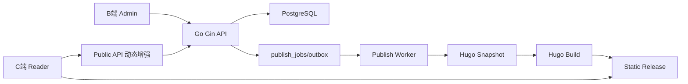

# 工程实施总控手册

本文是后续实际搭站的中心执行文档。它把“全栈博客系统”拆成可被 goal 跟踪、可被子 agent 分派、可被新窗口接力的工程计划。

## 1. 项目北极星目标

建设一个成熟完整的项目级全栈博客系统：

- C 端读者站点保留 Hugo Theme Stack 的视觉效果、内容组织、阅读体验、SEO 和静态性能。
- B 端后台控制台负责内容生产、发布审批、媒体管理、评论审核、用户权限、站点配置、审计和运营数据。
- 后端采用 Go Gin + GORM，以 PostgreSQL 作为编辑态事实数据源。
- 发布链路采用后台动态管理、Hugo 静态发布的 Hybrid CMS 架构。
- 工程过程采用中心窗口总控，多子 agent 并行，工作日志持续记录，上下文不足时由新窗口读日志接力。

## 2. 一句话实施策略

先把当前上游 Hugo Theme Stack 仓库改造成 monorepo 项目骨架，再逐步补齐 API、数据库、后台、发布 worker 和生产化能力；每个阶段必须先有任务编号、文件边界、验收方式和日志记录。

## 3. 工程原则

- PostgreSQL 是内容编辑源，Hugo content 是发布快照，不反向手改快照作为长期内容源。
- C 端主阅读路径不依赖数据库，评论、浏览量、点赞等动态能力以异步 Public API 增强。
- API 负责业务规则，不把复杂逻辑塞进 handler。
- 后台是生产工具，优先高密度、稳定、可恢复，而不是营销化视觉。
- 发布必须可追踪、可重试、可回滚。
- 生产迁移使用 SQL-first migration，不使用 GORM AutoMigrate 作为正式迁移手段。
- 任何工程实现都必须更新相关文档、任务看板和工作日志。

## 4. 当前默认架构

默认部署视角：

- `apps/site`：Hugo + Theme Stack C 端站点。
- `apps/api`：Gin API，包含后台接口、公开增强接口、发布任务入口。
- `apps/admin`：B 端后台。
- `db/migrations`：数据库迁移。
- `internal/publisher`：快照生成、Hugo 构建、产物发布。
- `infra`：Docker、Nginx、PostgreSQL、部署配置。

## 5. 决策门禁

实施前必须关闭 P0 决策。没有关闭时只能继续写文档和做只读分析。

| 决策编号 | 决策项 | 默认建议 | 未决影响 |
|---|---|---|---|
| DEC-P0-001 | 是否接受 Hybrid CMS | 接受 | 不接受则 API/C端/发布链路要重设计 |
| DEC-P0-002 | 后台技术栈 | React 18.3.1 + Vite + Arco Design React 2.66.15，react-router-dom 7.18.1 | 已落地，npm audit 为 0 漏洞 |
| DEC-P0-003 | 媒体生产存储 | 开发本地，生产预留 S3/R2/MinIO | 影响上传接口和发布资源路径 |
| DEC-P0-004 | 部署目标 | 单 VPS Docker Compose 起步 | 影响 compose、Nginx、备份、CI/CD |
| DEC-P0-005 | 评论范围 | MVP 支持匿名评论 + 审核 | 影响 Public API、反垃圾、隐私策略 |
| DEC-P0-006 | 前台读者账号 | MVP 不做读者注册 | 影响 auth 模型和 C 端交互 |
| DEC-P0-007 | 搜索方案 | MVP Hugo 本地搜索索引 | 影响构建产物和后台搜索字段 |
| DEC-P0-008 | 发布模式 | 先全量构建，后续增量优化 | 影响 worker 复杂度 |

决策记录位置：

- 决策清单：`docs/architecture/01-architecture-decisions.md`
- 重要决策 ADR：`docs/architecture/adr/`
- 工作流决策：`docs/process/worklog.md`

## 6. 阶段路线图

### Phase 0：工程基线

目标：让项目具备可运行、可协作、可验证的骨架。

工作包：

- `ARCH-P0-001`：确认 P0 架构 ADR。
- `OPS-P0-001`：创建 monorepo 目录。
- `API-P0-001`：初始化 Gin API 与 `/healthz`。
- `DB-P0-001`：初始化 migration 工具。
- `HUGO-P0-001`：整理 Hugo site 到 `apps/site`。
- `ADMIN-P0-001`：初始化后台项目。
- `CI-P0-001`：建立基础检查。

阶段验收：

- `git status` 中只有预期改动。
- `go test ./...` 可执行。
- PostgreSQL 可通过 compose 启动。
- Hugo 可 build 或 server。
- Admin dev server 可启动。
- `docs/process/worklog.md` 记录 Phase 0 结果。

### Phase 1：核心内容域

目标：完成后台内容、用户、权限、媒体、评论的数据模型和 API。

工作包：

- 认证与 refresh token。
- RBAC。
- 用户与作者。
- 文章、页面、分类、标签。
- 媒体资源与引用。
- 评论与审核。
- 审计日志。

阶段验收：

- 空库 migration 成功。
- 管理员 seed 可登录。
- 文章 CRUD、分类标签绑定、媒体上传、评论审核可通过 API 完成。
- 核心接口有权限校验和测试。

### Phase 2：B 端后台

目标：管理员能完成内容生产闭环。

工作包：

- 登录。
- 后台框架与权限菜单。
- 文章列表和编辑器。
- 页面管理。
- 分类标签管理。
- 媒体库。
- 评论审核。
- 发布中心基础版。
- 站点设置基础版。

阶段验收：

- 管理员可完成“写文章 -> 上传封面 -> 选分类标签 -> 预览 -> 发布请求”。
- 加载、空状态、错误状态齐全。
- 未授权用户无法进入后台。

### Phase 3：Hugo 发布集成

目标：后台内容可发布到保留 Stack 效果的 C 端静态站。

工作包：

- DB 内容到 Hugo front matter 映射。
- Hugo content 快照生成。
- 媒体资源复制或 URL 固化。
- Hugo build worker。
- 发布任务状态机。
- release manifest。
- 成功发布与失败回滚。
- C 端评论/统计异步增强。

阶段验收：

- 后台发布文章后，C 端首页、文章页、分类、标签、RSS、Sitemap 正确反映。
- Hugo build 失败不覆盖上一版线上产物。
- 发布记录可查，能切回上一个 release。

### Phase 4：生产化

目标：能安全部署和恢复。

工作包：

- Dockerfile 与 compose。
- Nginx 路由。
- HTTPS 和域名配置。
- 环境变量与 Secret 管理。
- CI/CD。
- 备份恢复。
- 日志、监控、告警。
- 安全基线。
- E2E 冒烟。

阶段验收：

- staging 可一键部署。
- production runbook 可照着执行。
- 备份恢复演练通过。
- 写作发布闭环 E2E 通过。

### Phase 5：增强能力

目标：提升长期内容运营能力。

候选能力：

- 全文搜索增强。
- 图片处理和 CDN。
- 定时发布。
- 版本 diff。
- 审批流。
- 数据看板增强。
- 多语言。
- 多站点。
- Webhook/插件机制。

## 7. Workstream 划分

| Workstream | 范围 | 主要文档 | 可并行性 |
|---|---|---|---|
| 架构 | ADR、模块边界、发布策略 | `docs/architecture/*` | 可与需求/运维并行 |
| 后端 | Gin、GORM、API、auth、业务服务 | `docs/backend/*` | 与 Admin 可并行，契约先行 |
| 数据库 | migration、schema、seed、索引 | `docs/database/*` | 与 API 强耦合，需联合验收 |
| Admin | B 端后台页面与状态管理 | `docs/frontend/*` | API mock 后可并行 |
| Hugo C端 | Stack 配置、快照、主题兼容 | `docs/frontend/site-stack-integration.md` | 与发布链路强耦合 |
| Publisher | 快照、构建、release、回滚 | `docs/architecture/publishing-pipeline.md` | 依赖内容模型 |
| Ops | Docker、CI/CD、备份、监控 | `docs/operations/*` | Phase 0 起持续推进 |
| QA | 测试策略、验收、E2E | `docs/qa/*` | 每阶段并行补齐 |
| Security | auth、上传、限流、日志脱敏 | `docs/security/*` | 从 Phase 1 开始阻断式验收 |

## 8. 中心窗口执行循环

每一轮 goal 执行按固定循环推进：

1. 读 `docs/process/task-board.md` 和 `docs/process/worklog.md`。
2. 从 WBS 中选择一个或多个 `Ready` 任务。
3. 判断哪些任务在关键路径上由中心窗口本地做，哪些可以派给子 agent。
4. 为每个子 agent 写清任务编号、背景、允许编辑、禁止编辑、验证方式、汇报要求。
5. 在任务看板登记状态、owner、agent、文件锁和开始时间。
6. 中心窗口同步做非重叠工作。
7. 子 agent 回报后进入 `Review`。
8. 中心窗口检查 diff、验证命令、风险与边界。
9. 验收通过后更新文档、任务看板、工作日志。
10. 若上下文接近上限，更新 handoff 后再开新窗口。

## 9. 子 Agent 使用规则

推荐派工类型：

- 只读探索：源码结构、主题行为、API 契约审阅、风险发现。
- 有界实现：明确目录和文件范围的代码修改。
- 文档草案：输出建议，由中心窗口统一写入关键总文档。
- 验证任务：独立跑测试、构建、浏览器检查。

禁止派工类型：

- 没有任务编号的大范围改造。
- 多个 agent 同时写同一文件。
- 让子 agent 做最终架构裁决。
- 让子 agent 回滚用户或其他 agent 改动。
- 没有验证方式的“完成某模块”。

## 10. 验收分级

| 等级 | 含义 | 可进入下一阶段 |
|---|---|---|
| Pass | 实现、测试、文档、日志均完成 | 可以 |
| Conditional Pass | 主要目标完成，有明确非阻断风险 | 可以，但风险进入看板 |
| Fail | 功能不可用、测试失败或范围越界 | 不可以 |
| Blocked | 等待用户决策、外部依赖或冲突处理 | 不可以 |

## 11. 阶段门禁

Phase 0 进入 Phase 1：

- monorepo 骨架完成。
- API、DB、Hugo、Admin 均可本地启动或构建。
- `.env.example` 完成。
- 工作日志记录环境和命令。

Phase 1 进入 Phase 2：

- 数据模型稳定。
- OpenAPI 或接口契约可供 Admin 使用。
- RBAC 和 auth 可用。
- API 测试基础通过。

Phase 2 进入 Phase 3：

- 后台内容生产闭环可走通。
- 文章、分类、标签、媒体、评论接口与页面基本可用。
- 发布中心能创建发布请求。

Phase 3 进入 Phase 4：

- 数据库内容能生成 Hugo 快照。
- Hugo build 可自动执行。
- 发布失败不破坏上一版产物。
- C 端 Stack 视觉保持。

## 12. 风险登记

| 风险 | 阶段 | 影响 | 缓解 |
|---|---|---|---|
| 主题源码被过度修改 | Phase 0-3 | 后续难升级 | 站点层覆盖优先，主题核心改动需 ADR |
| 数据模型与 Hugo 字段不匹配 | Phase 1-3 | 发布失败或页面缺字段 | front matter 映射文档和快照测试 |
| 发布构建阻塞 API | Phase 3 | 后台请求慢或失败 | worker + job + 状态机 |
| 媒体删除破坏旧文章 | Phase 1-4 | C 端资源 404 | 媒体引用追踪和删除保护 |
| 权限粒度后补困难 | Phase 1-2 | 后台安全风险 | RBAC 权限码先行 |
| 上下文丢失 | 全阶段 | 重复劳动或误改 | 工作日志、task board、handoff |
